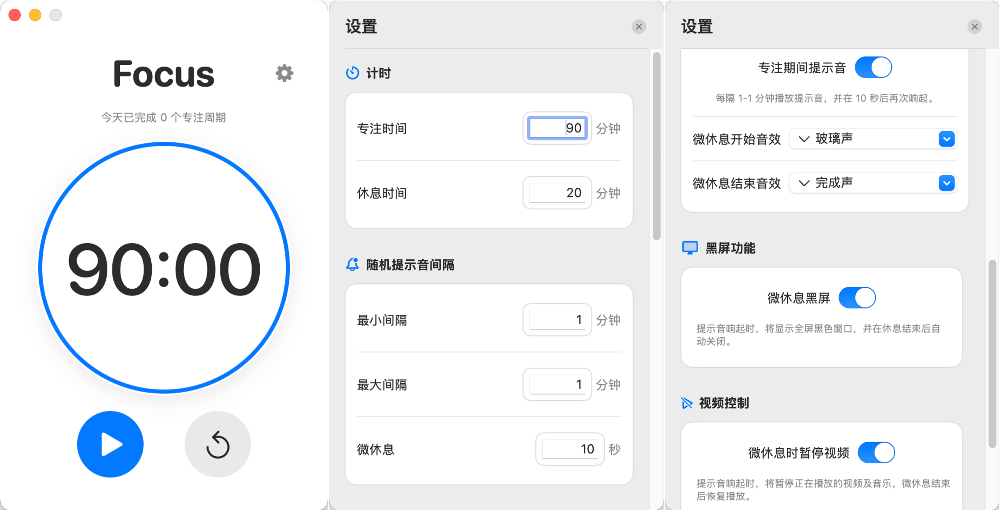

# Focus - 专注时钟

## 简介

Focus是一款加入**随机提示音**的macOS专注计时器应用

## 核心功能

- ⏱️ **专注计时**：默认90分钟专注，20分钟休息
- 🔔 **微休息提醒**：每隔3-5分钟随机提示音，提醒短暂休息10秒，随后自动二次提示，引导回归专注状态
- ⚙️ **自定义设置**：灵活调整所有时间参数，适配个人工作习惯
- 📊 **状态栏显示**：在macOS菜单栏实时显示剩余时间

## 使用方法
> 快速使用：下载并解压 ZIP 文件，然后将应用图标拖拽到 MAC"应用程序"文件夹中即可。

> 自行构建：克隆本仓库，自行修改和编译代码。
1. 启动应用后，点击"开始"按钮开始专注
2. 听到提示音时，短暂闭眼休息10秒，待二次提示音响起后，自然过渡回工作状态
3. 专注时间结束后，进入长休息
4. 通过设置按钮自定义各项参数

## 科学原理

基于[《为什么我能每天学习10小时》](https://www.bilibili.com/video/BV1naLozQEBq)中介绍的科学休息法，通过合理安排微休息和完整休息，有效缓解疲劳，并加强学习效率，提高长时间工作的可持续性。

## 项目结构与核心文件

本项目主要包含以下核心目录和文件：

- `Focus/`: 应用程序的源代码，包含主要的业务逻辑和UI实现。
  - `FocusApp.swift`: 应用的入口，负责启动和生命周期管理。
  - `ContentView.swift`: 主视图，展示专注计时和控制按钮。
  - `TimerManager.swift`: 计时管理，处理专注/休息倒计时和提示音逻辑。
  - `StatusBarController.swift`: 状态栏控制器，管理菜单栏图标和用户交互。
  - `StatusBarView.swift`: 状态栏视图，展示剩余时间及状态信息。
  - `SettingsView.swift`: 设置界面，用于自定义时间和其他偏好。
  - `VerticallyAlignedTextFieldCell.swift`: 垂直对齐的文本单元格，用于设置界面输入框。
  - `Info.plist`: 应用属性列表，配置 Bundle 标识、权限和版本信息。
  - `Focus.entitlements`: 权限文件，声明 App Sandbox 权限配置。
  - `Assets.xcassets/`: 资源目录，存放图标和图片等资源。
  - `Preview Content/`: SwiftUI 预览资源目录。
- `Focus.xcodeproj/`: Xcode 项目文件，用于配置、构建和管理项目。
- `README.md`: 项目说明文档，包含项目介绍、功能、使用方法等。
- `FocusTests/` 和 `FocusUITests/`: 项目的单元测试和UI测试代码。
- `images/`: 存放项目相关的图片资源。
- `Focus.app.zip`: 构建生成的应用打包文件。
