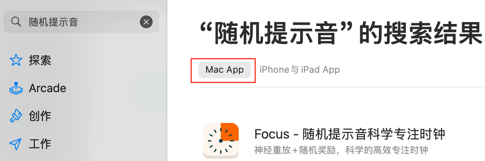

# Focus - 随机专注时钟

## 🍎 苹果应用商店版本

为了让更多用户便捷使用，Focus 已正式上架苹果应用商店！

**下载方式：**
- 在 App Store 中搜索「**随机提示音**」
- 选择「**Mac App**」版本进行下载

**版本更新策略：**
- 本项目将持续保持开源
- GitHub 仓库会第一时间发布最新功能
- 稳定版本会同步至 App Store

## 简介

Focus是一款加入**随机提示音**的macOS专注计时器应用。

Focus 的核心设计灵感来源于神经科学和心理学的研究成果：
1.  **间隔效应 (Gap Effects)**：神经科学家 Andrew Huberman 教授指出，学习过程中短暂的、几秒钟的停顿，可以触发大脑神经元的快速回顾机制，有效提升学习和记忆效率。Random Focus 的随机提示音和小憩功能正是基于此原理，引导用户利用碎片化的时间进行高效的信息巩固。（参考：Huberman Lab 播客 - [像天才一样学习](https://www.bilibili.com/video/BV1BopsenEaW/?share_source=copy_web&vd_source=80067a9d068c4c06488f9be7364e3539)，1:22:03 处）
2.  **随机奖励 (Random Rewards)**：心理学研究表明，不可预测的随机奖励比固定奖励更能激发持续的行为动力。本应用中的随机提示音，在提醒休息的同时，也扮演了积极反馈的角色，帮助用户克服长时间专注带来的疲惫感，保持学习或工作的动力。（灵感来源：[为什么我能每天学习10小时](https://www.bilibili.com/video/BV1naLozQEBq/?share_source=copy_web&vd_source=80067a9d068c4c06488f9be7364e3539)）

## 界面展示

### 应用界面

### 数据统计界面

### 全屏模式

## 核心功能

- 🔔 **微休息提醒**：每隔 3-5 分钟响起提示音，提醒短暂休息10秒，随后自动二次提示，引导回归专注状态（所有参数可调）
- 🖥️ **微休息全屏幕**：可开启强制全屏幕功能，在微休息时自动覆盖所有显示器画面，帮助用户强制休息，微休息结束后自动恢复
- 🎞️ **媒体控制功能**：微休息期间自动切换播放/暂停状态，观看视频/网课时建议开启，其他场景可关闭。（首次使用需授予辅助功能权限）
- 📊 **数据统计**：专注数据统计功能，支持日/周/月/年多时间段查看，提供可视化图表展示专注次数和时长，包含总专注次数、总时长、平均时长、连续天数等详细统计信息
- 🕐  **状态栏显示**：在macOS菜单栏实时显示剩余时间
- 🌓 **界面适配：** 支持浅色与深色模式，自动跟随系统设置
- 🎵 **可选择音效**：支持自定义选择微休息开始和结束的提示音效
- 💻 **芯片兼容：** 支持Intel芯片和M系列，原生优化性能表现。

## GitHub 开源版本使用方法
**快速使用**：下载 `Focus.dmg` 文件（或访问 Releases 页面获取最新版本），然后将应用程序图标拖拽到 macOS "应用程序"文件夹中。

**自行构建**：克隆本仓库，自行修改和编译代码。

⚠️ 注意: 首次打开应用时，若系统提示"Apple 无法检查其是否包含恶意软件"，请前往"系统设置" -> "隐私与安全性" -> "安全性"部分，找到相关提示并点击"仍要打开"。

### 使用方法
1. 启动应用后，点击"开始"按钮开始专注
2. 听到提示音时，短暂闭眼休息10秒，待二次提示音响起后，自然过渡回工作状态
3. 专注时间结束后，进入长休息
4. 通过设置按钮自定义各项参数，包括：
   - 专注和休息时间长度
   - 微休息提示音间隔
   - 微休息音效选择
   - 黑屏功能开关
   - 微休息通知开关
   - 视频/音频暂停功能
   - 状态栏显示设置
5. 点击统计按钮查看专注数据分析，了解专注习惯和进步情况

## 系统要求

- macOS 14.1 或更高版本
- 兼容 Intel 和 M 芯片

## 项目结构与核心文件

本项目采用 **SwiftUI + MVVM** 架构，核心文件包括：

- `Focus/`: 应用程序的源代码，包含主要的业务逻辑和UI实现。
  - `FocusApp.swift`: 应用的入口，负责启动和生命周期管理。
  - `ContentView.swift`: 主视图，展示专注计时和控制按钮。
  - `TimerManager.swift`: 计时管理，处理专注/休息倒计时和提示音逻辑。
  - `StatisticsView.swift`: 数据统计界面，提供可视化图表和统计信息展示。
  - `StatisticsManager.swift`: 统计数据管理器，处理专注数据的收集、存储和分析。
  - `BlackoutWindowController.swift`: 黑屏控制器，管理微休息强制黑屏功能和倒计时显示。
  - `StatusBarController.swift`: 状态栏控制器，管理菜单栏图标和用户交互。
  - `StatusBarView.swift`: 状态栏视图，展示剩余时间及状态信息。
  - `SettingsView.swift`: 设置界面，用于自定义时间和其他偏好，采用现代化设计风格。
  - `VideoControlManager.swift`: 视频控制管理器，处理媒体播放的暂停和恢复。
  - `VerticallyAlignedTextFieldCell.swift`: 垂直对齐的文本单元格，用于设置界面输入框。
  - `Info.plist`: 应用属性列表，配置 Bundle 标识、权限和版本信息。
  - `Focus.entitlements`: 权限文件，声明 App Sandbox 权限配置。
  - `Assets.xcassets/`: 资源目录，存放图标和图片等资源。
  - `Preview Content/`: SwiftUI 预览资源目录。
- `Focus.xcodeproj/`: Xcode 项目文件，用于配置、构建和管理项目。
- `README.md`: 项目说明文档，包含项目介绍、功能、使用方法等。
- `FocusTests/` 和 `FocusUITests/`: 项目的单元测试和UI测试代码。
- `images/`: 存放项目相关的图片资源。
- `Focus.dmg`: 构建生成的应用打包文件。

## 许可协议

本项目采用 **Creative Commons Attribution-NonCommercial 4.0 International License (CC BY-NC 4.0)** 开源。详情请参见 [LICENSE](LICENSE) 文件。

### 您可以：
- ✅ **分享** — 以任何媒介或格式复制、发行本作品
- ✅ **演绎** — 修改、转换或以本作品为基础进行创作

### 惟须遵守下列条件：
- 📝 **署名** — 您必须给出适当的署名，提供指向本许可协议的链接，同时标明是否（对原始作品）作了修改
- 🚫 **非商业性使用** — 您不得将本作品用于商业目的

### 商业使用说明
如需商业使用本软件，请联系作者获取商业许可。个人学习、教育用途、非营利组织使用不受此限制。
